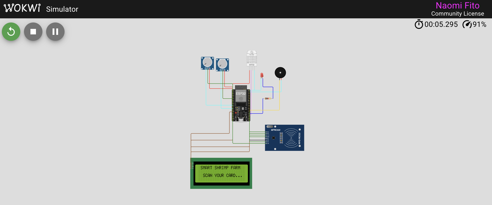

# Smart Shrimp Farm
IoT-based shrimp farm monitoring system using ESP32 and Wokwi simulation.

## Wokwi Simulation Preview

## Features
- Water quality monitoring
- Real-time monitoring system
- ESP32 integration
- RFID/Card reader access system
- Sensor simulation using Wokwi

## Technologies
- ESP32
- Arduino
- PlatformIO
- Wokwi
- RFID Module

## System Overview
This project is designed to help automate and monitor shrimp farming environments using IoT technology. The system also implements RFID/card reader access for secure system interaction and monitoring access.

## Author
Naomi Fito
